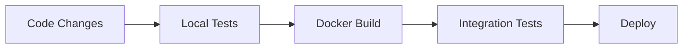
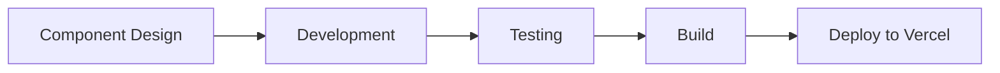

# 🛍️ ShopEase: Modern E-Commerce Solution

## Project Vision
ShopEase represents the future of e-commerce platforms, combining cutting-edge technology with seamless user experience. Built with a microservices architecture, our platform demonstrates how modern web technologies can create robust, scalable online shopping experiences.

## Technical Innovation

### Backend Excellence
Our FastAPI-powered backend showcases several innovative features:
- **High-Performance API Layer**: Utilizing FastAPI's async capabilities for lightning-fast response times
- **Robust Data Management**: PostgreSQL + SQLAlchemy combination for reliable data handling
- **Container-Ready Architecture**: Full Docker implementation for consistent deployment
- **Automated Pipeline**: Integrated CI/CD for reliable delivery

### Frontend Brilliance
The Next.js frontend demonstrates modern web development best practices:
- **Server-Side Rendering**: Optimized for SEO and performance
- **Dynamic Routing**: Sophisticated URL handling for better user navigation
- **Responsive Design**: Seamless experience across all devices
- **API Integration**: Clean separation of concerns with backend services

## Live Demo Highlights

### Backend Features
```bash
# Quick Start Guide
git clone https://github.com/ianMuchesia/Shop-Ease.git
cd Shop-Ease/server
docker build -t shopease .
docker run -p 8000:8000 shopease

# Access Points
API Documentation: http://localhost:8000/docs
Health Check: http://localhost:8000/health
```

### Frontend Experience
```bash
# Launch Development Environment
cd client
npm install
npm run dev

# Access Points
Main Store: http://localhost:3000
Admin Dashboard: http://localhost:3000/admin
```

## Technical Deep Dive

### Database Architecture
- **Migration Management**: Alembic for version control
  ```bash
  # Create new migration
  alembic revision -m "Add user profiles"
  
  # Apply migrations
  alembic upgrade head
  ```

### API Features
1. **Authentication System**
   - JWT-based secure access
   - Role-based permissions
   - Refresh token mechanism

2. **Product Management**
   - Advanced search capabilities
   - Category organization
   - Inventory tracking

3. **Order Processing**
   - Real-time status updates
   - Payment integration
   - Shipping calculation

## Development Workflow

### Backend Development


### Frontend Development


## Future Roadmap
- **Q1 2025**: AI-powered product recommendations
- **Q2 2025**: Mobile app integration
- **Q3 2025**: International marketplace features
- **Q4 2025**: Advanced analytics dashboard

## Live Deployment
- Frontend: [shopease-demo.vercel.app](https://shopease-demo.vercel.app)
- Backend: [api.shopease-demo.com](https://api.shopease-demo.com)

## Get Involved
We welcome contributions! Here's how:
1. Fork the repository
2. Create your feature branch
3. Commit your changes
4. Push to the branch
5. Create a Pull Request

## Technical Stack Overview
- **Backend**: FastAPI, PostgreSQL, SQLAlchemy, Alembic
- **Frontend**: Next.js, React, TailwindCSS
- **Infrastructure**: Docker, GitHub Actions
- **Monitoring**: Prometheus, Grafana

## Contact & Support
- GitHub Repository: [github.com/ianMuchesia/Shop-Ease](https://github.com/ianMuchesia/Shop-Ease)
- Documentation: [docs.shopease-demo.com](https://docs.shopease-demo.com)
- Technical Support: [support@shopease-demo.com](mailto:support@shopease-demo.com)
